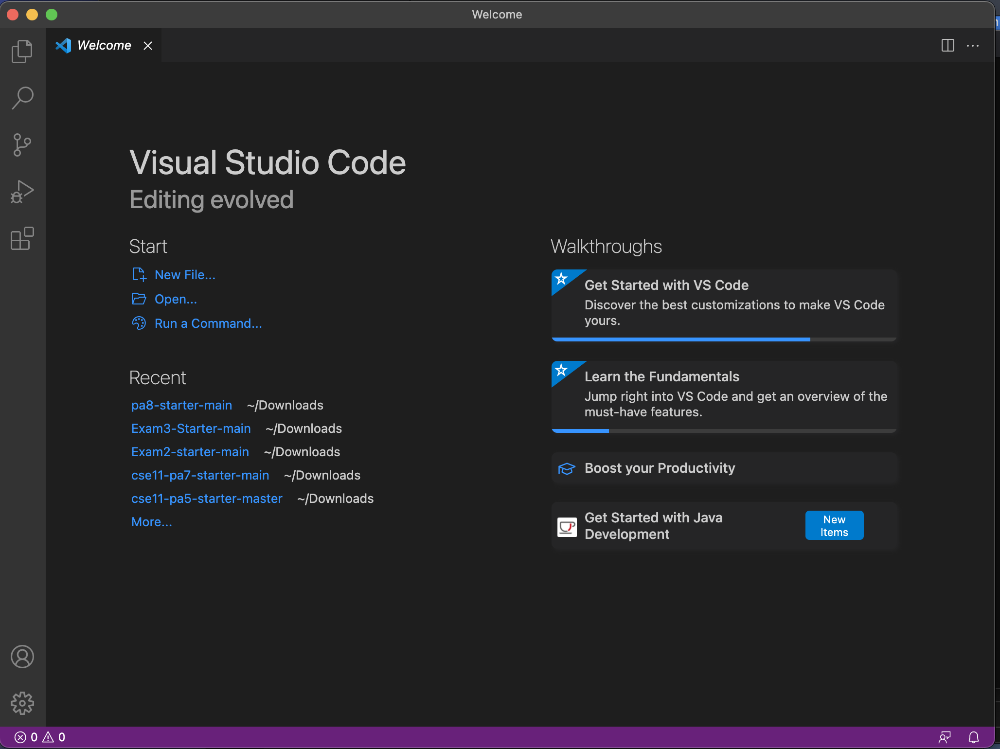
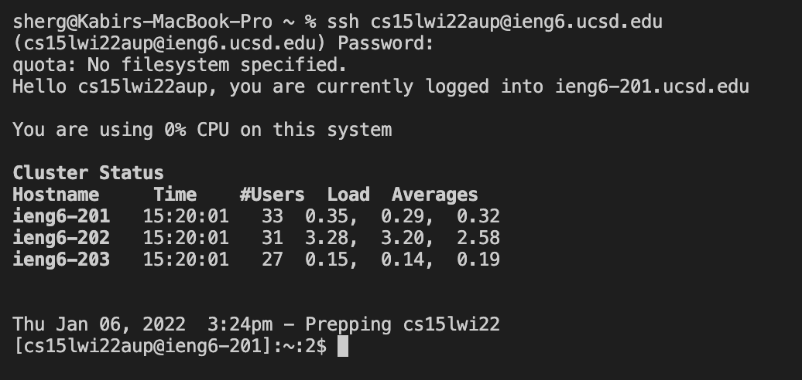
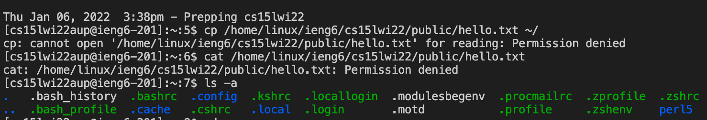
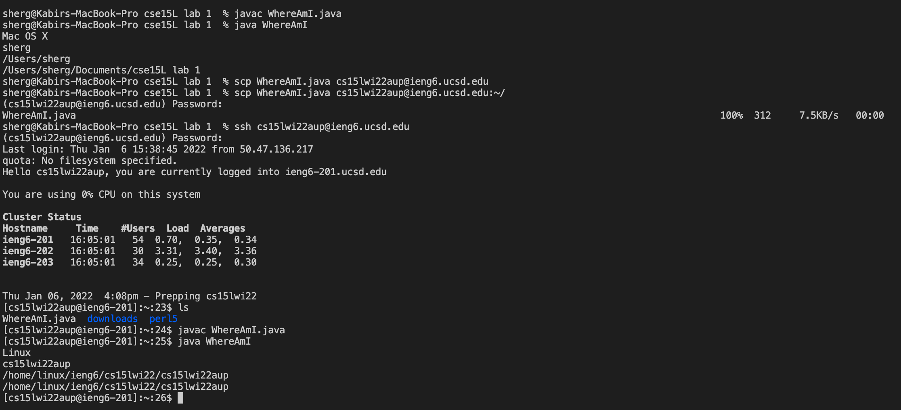
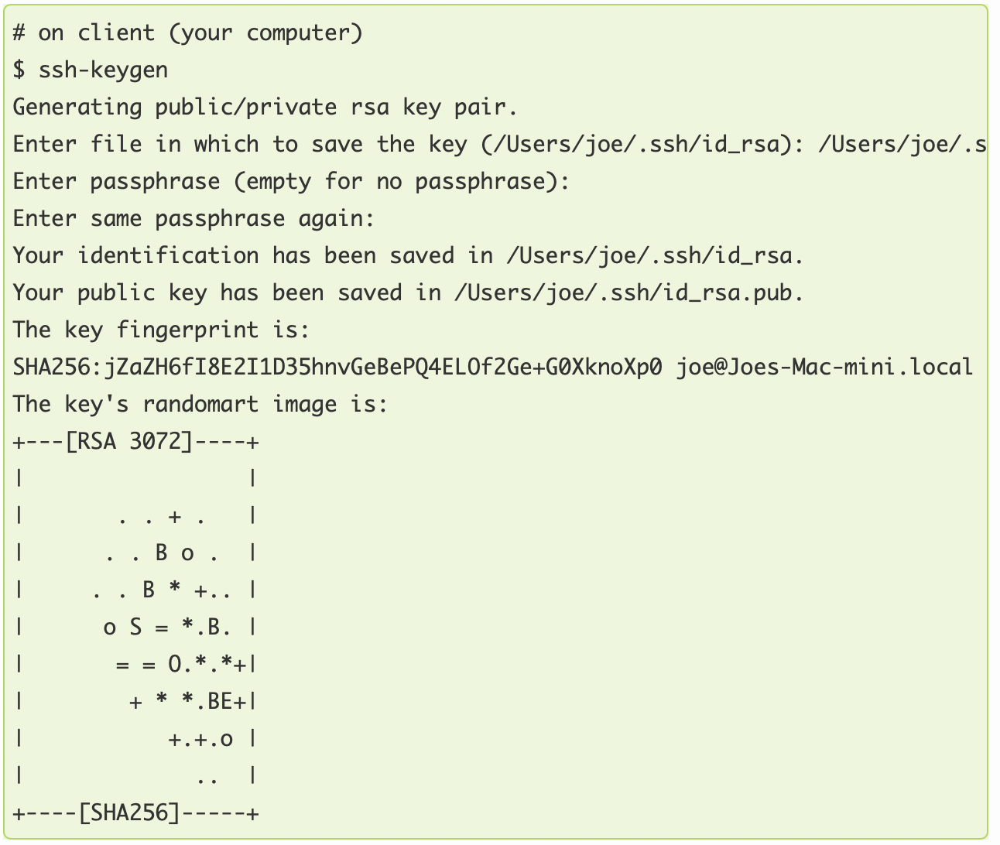
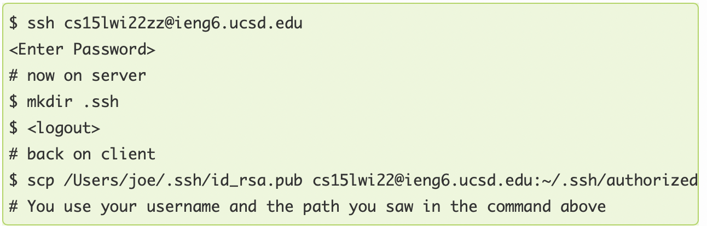
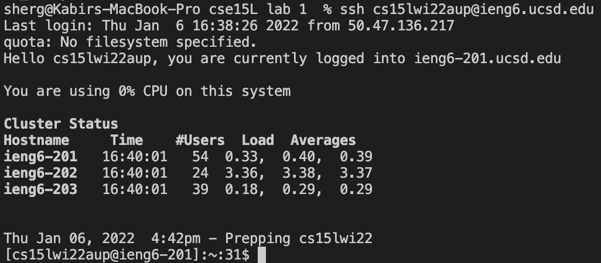
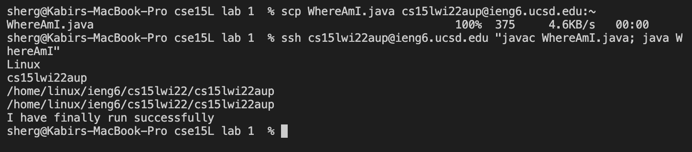

# How I Set Up my Mac to Work with a Remote Server

## Step 1: Download and Install VS Code

 This step is very simple, as you can just go to the [Visual Studio Code website](https://code.visualstudio.com/). Once you are there, follow the instructions to download VS Code for your specific OS. 

---
## Step 2: Connecting to the Remote Server

Since I am on MacOS, I went to the Menu Bar, clicked Terminal -> new Terminal. Then, I typed into the terminal 'ssh', followed by my username, 'cs15lwi22aup@ieng6.ucsd.edu'. So the final command into the terminal was: 'ssh cs15lwi22aup@ieng6.ucsd.edu'. Then, it will prompt you to type in a password. Don't worry if you don't see the text content of your password, it is designed that way. A successful connection should look something like this:

---

## Step 3: Testing Out a Few Commands

There are dozens of different commands to try on the remote server. The two commands that I tried were 'cp' and 'cat'. First, I typed 'cp' followed by the directory of the file that was in the remote server by the name of 'hello.txt'. However, it gave me a message saying: 'cannot open for reading: Permission denied'. Therefore, I am guessing the cp command allows a user to at least access a certain file, if only it is kept public. I tried the same thing with the 'cat' command but I got the message: 'Permission denied'. My best guess is that this time it was trying to write to the file, but again the file was kept private from us.

---

## Step 4: Move your Local Files to the Remote Server over SSH with scp

So a key function of working remotely is being able to create and edit files on your local computer, and then copy them over to the remote server so that you can run them on there. So I first created a file called WhereAmI.java and added some code to it. Then, I typed in the command into the terminal: 'scp', then my username: 'cs15lwi22aup@ieng6.ucsd.edu', and then ':~/'. It should ask you to enter your password after you hit enter. Then, I logged back into ieng6 and was able to compile and run the program on the remote server. 

---

## Step 5: Using SSH Keys!

So the annoying part about using the remote server is that it prompted me for my password everytime I wanted to access the server. I was able to solve that problem by ssh keys. Essentially, what I did was using the program 'ssh-keygen' I was able to create a pair of files called a public and a private key. The private key is kept to a private location on the local client, and the public key public key is copied to a place on the server. That way, the system uses the keys to authenticate you, instead of you having to type in a password everytime. Here is an image showing the commands you can type in, keep in mind your directory for the files will obviously be named differently:

After this step, you know have a private key and a public key on your computer, but we then need to copy the public key onto the remote server. Here is how the commands look for that portion:

The above two images were screenshots courtesy of my CS15L professor Joe Politz. The below image is back to my own process, and this is how it looked when I was able to finally log into the remote server without typing in my password:

---

## Step 6: Streamlining Remote Running

Now, using some tricks when writing commands I was able to copy and run files on the remote server much quicker. The first trick was using semi-colons to run multiple commands on the same line, and then second was using quotation marks around the 'javac' and 'java' commands to compile and run my file on the remote server in one line. Here is me first copying the file WhatAmI.java to the server, and then compiling and running it on the server in a total of two lines :

