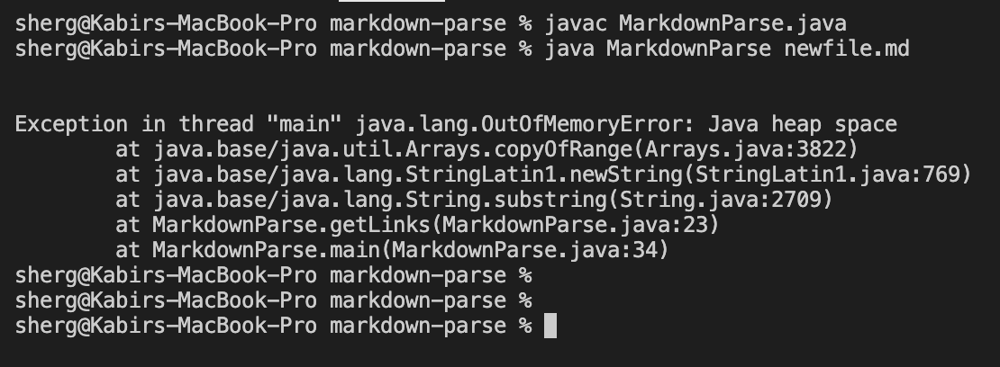
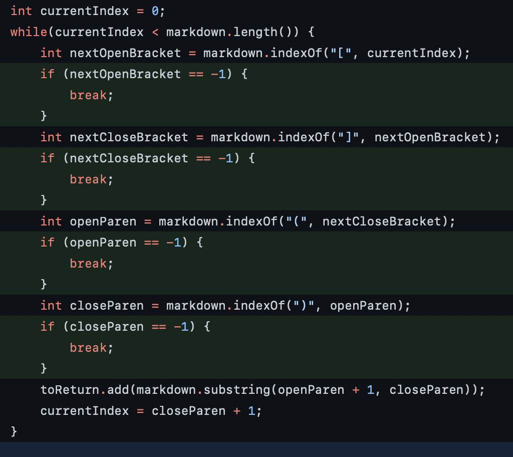
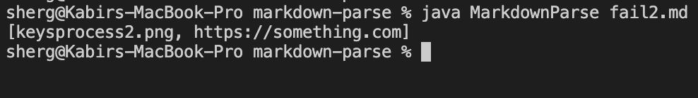
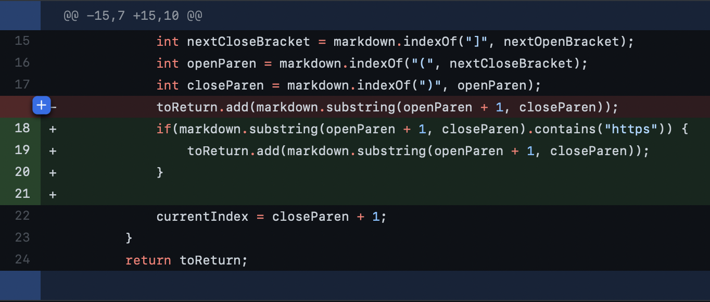
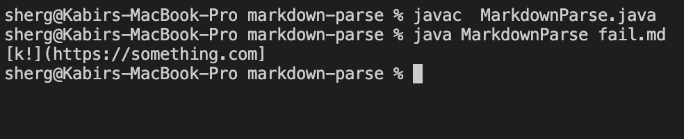
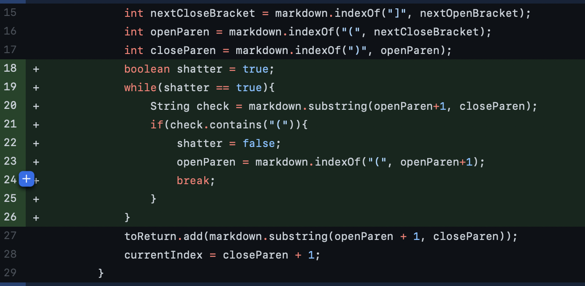

# My First Group Experience Debugging

## **The First Bug Fix:**

* First off, here the link to the file that [caused the failure.](https://github.com/phrzdgal/markdown-parse/blob/main/newfile.md) 

* Here is a photo of the ouput that the *failure-inducing input* caused:

    

* In this case, the failure (symptom) was a *java.lang.OutOfMemoryError*.

* These are the changes we made to the code in order to fix the bug:

    

* Essentially, the bug was that the while loop would loop infinitely many times, because its condition was that so long as currentIndex was less than markdown.length, the loop should keep running. So the problem was that if the program could not find the index of either `nextOpenBracket`, `nextCloseBracket`, `openParen`, or `closeParen`, it would return -1. Consequently this would mean that `currentIndex` would never be incremented because the value of `closeParen` would be -1, and -1 + 1 = 0. Therefore, the condition in the while loop would never evaluate to false. The *symptom* was that the program went into an infinite loop and we got a *java.lang.OutOfMemoryError*. Also what's important to remember was the failure-inducing input, which a bunch of open parentheses without closed parentheses, and some open brackets that didn't have closed brackets. This is what revealed the program behavior that we had to fix.

---

## **The Second Bug Fix:**

* First off, here is the link to the file that [caused the failure](https://github.com/fighterkabir/markdown-parse/commit/0e05f82551ef8c36d66acbe3d82309b472dfdd9d).

* Here is a photo of the output that the *failure inducing input* caused:

    

* In this case, the failure (symptom) was that the program was only supposed to print out the links in the file and **NOT** anything else, including the names of images in the file.

* These are the changes we made to the code in order to fix the bug:

    

* Essentially, the bug was that the code was not discriminating against the content within the parentheses, meaning that it didn't matter whether what was inside the parenthese was a link or not, the code would treat it the same. So our failure-inducing input was a file that an image name. The symptom was that the program would ouput both the link and the image name.

---

## **The Third Bug Fix:**

* First off, here is the link to the file that [caused the failure](https://github.com/fantasticfishman/markdown-parse/commit/5c75bdd0f93c274757cfc52fb43b521f0a53cd9c).

* Here is a photo of the ouput that the *failure inducing input* caused:

    

* Here, the failure (symptom) is that the program is once again printing something that is **NOT** a link. In this case "k!]". 

* These are the changes we made to the code in order to fix the bug:

    

* The way the code was initially written was that it would count all the text within the first open parentheses and closed parentheses, and basically not check whether the text between had another open parentheses. So the way we fixed that was by manually checking with a while loop and if statement whether the text within the parentheses contains an open parantheses. If it does, then the text of the link is considered the text after that second open parentheses and not the first. The failure-inducing output was a file that had an open parentheses, then non-link text, and then the second (real) open parentheses.