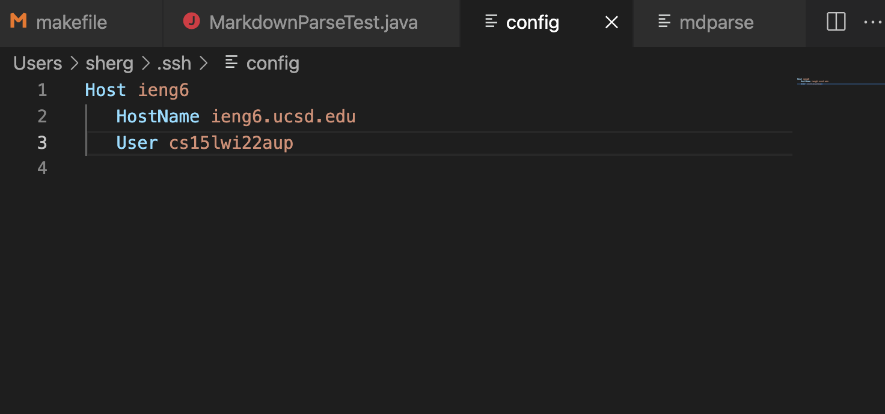
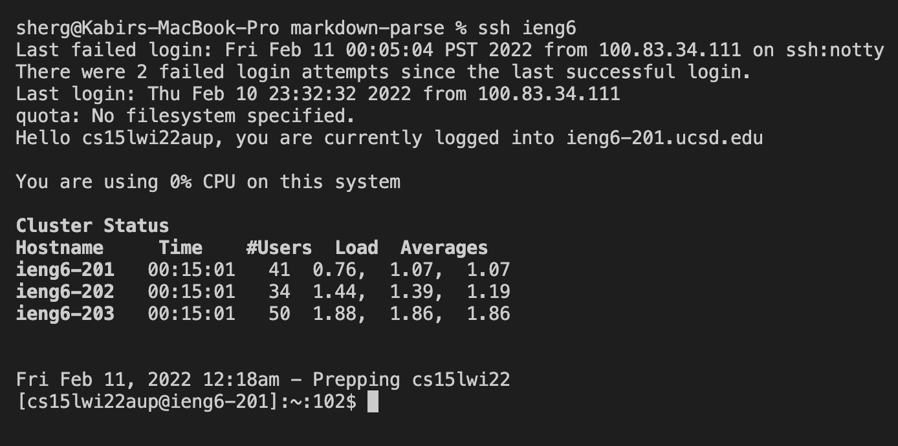
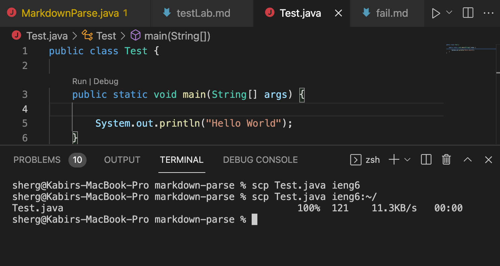

# Streamlining How I Log Into the Remote Server

---

## Step 1: Editing My .ssh/config File

* I was able to open my .ssh/config in VS Code and edit it there. The purpose of the edit was so that I could tell ssh what username to use when logging into the `@ieng6` server, and also give the server a short-hand reference of "ieng6". Although, this short-hand could be changed to anything I wanted. Next to `Host` is where i specified the "nickname" for the server. 

---

## Step 2: Logging Onto the Remote Server With My New Alias:

* Now, all I have to type in when attempting to access the remote server is `ssh` follwed by my nickname: `ieng6`.

---

## Step 3: Trying the `scp` command:

* Given my setup now, I am also able to use the shorthand notation to copy over a file to the remote server in much the same way I did while accessing the server. To test it out, I created a file in my markdown-parse folder called `Test.java`. Originally I would have had to type out `scp Test.java cs15lwi22aup@ieng6.ucsd.edu:~/`, but now I can replace the long username+servername portion with the nickname `ieng6` like before. Here it is in action:

---

## And that's it! Thanks for reading!
