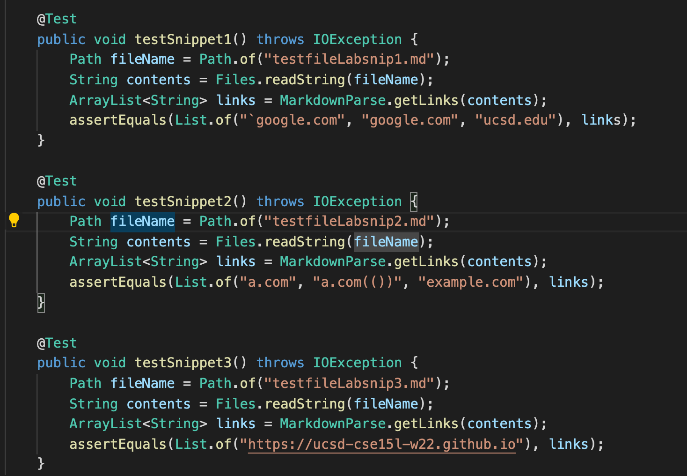
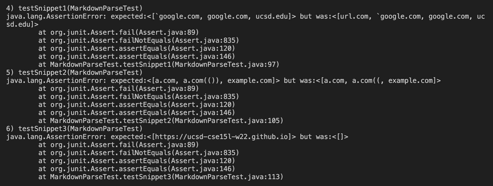
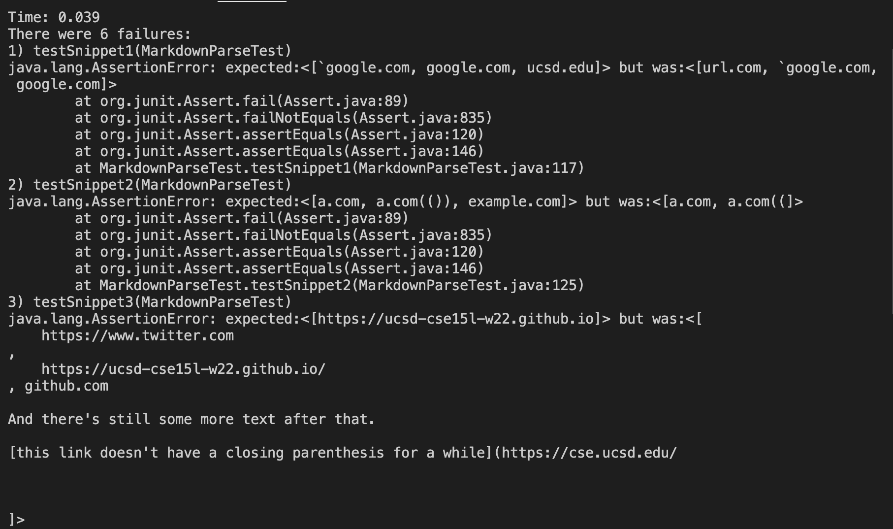

# Comparing Two Designs of M.P

## First, A Couple Notes:

* I compared what was my implementation of MarkdownParse with a different one that was reviewed by my group in lab. Here is a link to both repositories:

    1. [Mine](https://github.com/fighterkabir/markdown-parse)
    2. [The one we reviewed](https://github.com/LippsVega/markdown-parse)

&nbsp;

 
 * To establish the expected output, I used VS Code's preview function for markdown.

---
## Part 1 - The Test I Used To Compare:

* The test files I used to compare these two implementations are shown in the lab description for week 8 which can be found on [this link](https://ucsd-cse15l-w22.github.io/week/week8/#week-8-lab-report).

* Here is the code I added to both `MarkdownParseTest.java` files (JUnit tests needed to test the new file inputs) :

    

---
## Part 2 - Testing My Implementation:

* Here is the JUnit Output for my implementation:

    

&nbsp;

* As you can see, my implementation did not spit out the correct ouput on all three of the snippets.

&nbsp;

* For the first snippet test, I think the code change would be very small, (less than 5 lines) to induce the correct output. This is because the only difference betweeen the expected output and the actual ouput was and extra link at the beginning (it counted url.com when it shouldn't have). It's essentially a matter of adding a line so that the code ignores brackets that are within backticks.

&nbsp;

* For the second snippet test, I think the code change would also be fairly small due to the fact that the difference is in the second link forgetting to include the two closing parentheses. In this case, we can include a small portion of code that makes sure to include pairs of parentheses. This will be more involved than the first change, but not too bad.

&nbsp;

* For the third snippet test, I think the code change would have to be more involved as well. This is because I am unsure as to why the program is not recognizing any of the links in the file. I am of course suspecting this to be the case because the program is rendered useless with links over multiple lines and spaces. This is a more or less of a complete guess, but as of now, I can't seem to figure out why none of the links at all aren't being recognized.

---

## Part 3 - Testing the Other Version:

* Here is the JUnit Ouput:

    

&nbsp;

* As you can see, the other implementation also failed all three snippet tests.

