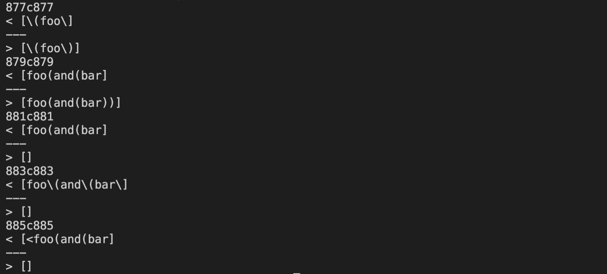
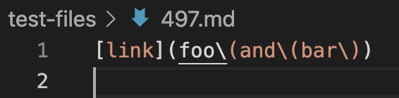
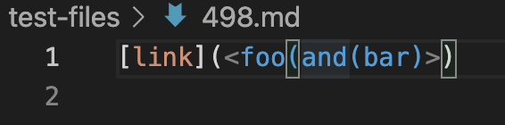
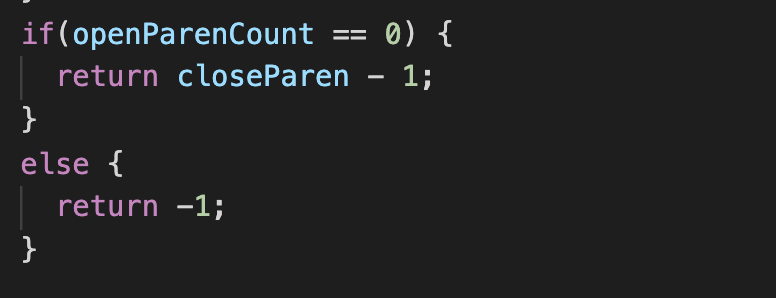
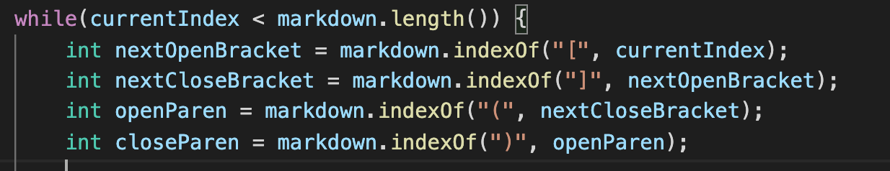
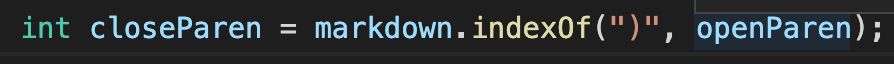

# Comparing Two Implementations Again

## Background Notes :

&nbsp;

- I used VS Code's markdown preview to establish the expected/correct output.

&nbsp;

- In this case, we are comparing my markdown parse implementation with Joe's.

&nbsp;

---

## Step 1 - Using `diff` to Compare output:

&nbsp;

- First off, I used `bash script.sh > results.txt` on both implementations to run them against 652 different markdown files and then save the output of each of those tests to a file called `results.txt`. In the `results.txt` file was also saved the name of the markdown file corresponding to each output so I could easily tell which file corresponded to which output.

&nbsp;

- Then, using the `diff` command, I was able to determine each of the differences between the two output to tell for which test the implementation were disagreeing. Here is a photo of that output below:

&nbsp;

&nbsp;

---

## Step 2 - Determining Which Set Of Outputs Corresponds to Which Test + What should be the Expected Output?

&nbsp;

- So for the purposes of this report, I will be using the two outputs at the bottom that were different which, by looking at the line number, I can see correspond to files `497.md` and `498.md`.

&nbsp;

- Here is test file `497.md` :

&nbsp;

&nbsp;

- The expected output is : `[foo(and(bar)]`.

- For my implementation the output was : `[foo\and\bar\]`.
- For Joe's the output was : `[]`.
- So clearly, both implementations are wrong in this scenario.

&nbsp;

- Here is the test file `498.md` :

&nbsp;

&nbsp;

- The expected output is : `[foo(and(bar)]`.
- For my implementation the output was : `[<foo(and bar)]`.
- For Joe's the output was: `[]`. 
- So again, both implementations are wrong in this scenario.

&nbsp;

---

## Step 3 - What are the Bugs and What Code Needs Fixing?

&nbsp;

### For file `497.md` :

&nbsp;

- Since both implementations are wrong, for this test, lets focus on whats wrong with Joe's.

- Joe's implementation isn't even recognizing a link at all in the file. The reason for this is a bug in the `findCloseParen` method. The `getLinks` method is structured in such a way that if any one of the values `nextOpenBracket`, `nextCloseBracket`, `closeParen`, or `openParen` are negative then the method will return the state of the ArrayList immediately. Given this, for this file, since it is only one line, if on the first go the method finds any of these values negative then it will return an empty list, which is the output we are getting. Well in this case, the only value it could be finding as negative is `closeParen` since all the other values are set to a non-negative number on the first go round.

- Now the problem with the `findCloseParen` method is quite straightforward actually: the only case in which it will return a non-negative number is if the number of close parentheses matches the number of open parentheses. And in this file, since there are 3 open parentheses and only 2 close parentheses, the method will return -1 which will in turn result in an empty output as described above.

- Here is the code that should be fixed:

&nbsp;

&nbsp;

### For file `498.md` :

&nbsp;

- Since both implementations are wrong, for this test, lets focus on what's wrong with my implementation.
- The first issue is that my program doesn't recognize that open and close brackets are special characters in markdown because the language is so closely related to HTML. For this reason, the program needs to include some functionality that makes sure that whatever is nested within a pair of open and close parentheses is what is counted as the link. Right now, the program is treating only everything within the open and close parentheses as consideration for a link and so that is why it is including a less-than sign when it shouldn't.
- The code that needs to be fixed is the upper half of the getLinks method where we are initializing special values such as `openParen` and `closeParen` so that it includes the symbols for greater-than and less-than so the method takes them into account :

&nbsp;

&nbsp;

- Now the second issue is that my program is ignoring the second-to-last close parentheses and not including it as part of the link. The reason for this is in the way my program is finding the value of `closeParen`. Right now, all the program is doing is setting the value of `closeParen` equal to one minus the index of first occurence of a close parentheses after `openParen`. For this test file, that means one minus the index of the second-to-last parentheses overall, therefore in the end, `toReturn` will return everything after the first open parentheses and before, not the last close parentheses, but the second-to-last close parentheses which is not what we want because it the end of the link will read `(bar` when it should read `(bar)`. Therefore, this part of the code needs to be fixed : 
so that the closeParen is found in a more clever manner so it takes into regard everything before the last close parentheses.

